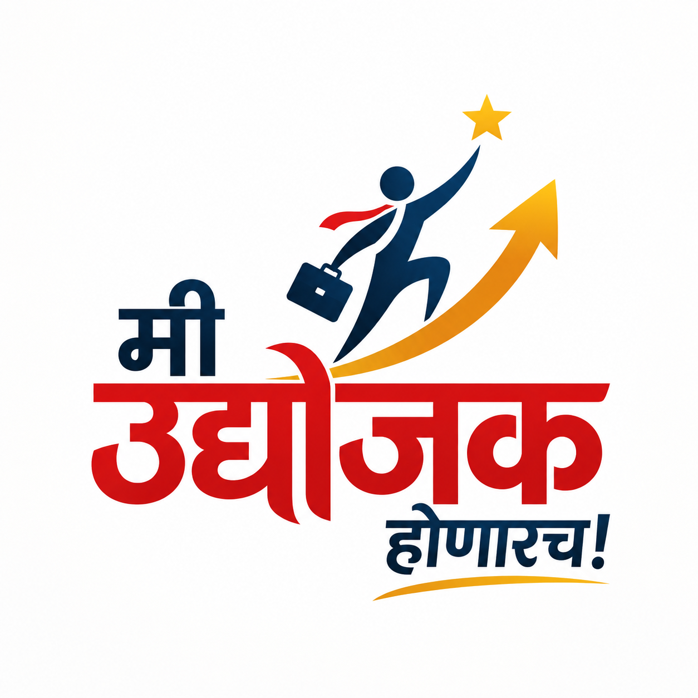

# 🚀 Mi Udyojak Honarach! (मी उद्योजक होणारच!)

<div align="center">
  
  <h3>"Dream Local. Build Something Big."</h3>
  <p><strong>Transforming Entrepreneurial Ambition into Lasting Action Across Maharashtra.</strong></p>

  [](https://react.dev/)
  [](https://www.typescriptlang.org/)
  [](https://vitejs.dev/)
  [](https://tailwindcss.com/)
  [](https://motion.dev/)
  [](LICENSE)
</div>

---

## 📖 Overview

**Mi Udyojak Honarach (मी उद्योजक होणारच!)** is a high-performance web platform built for Maharashtra's premier grassroots entrepreneurship movement. Founded by **Nilesh More**, the initiative is committed to inspiring, educating, and mentoring aspiring youth, first-generation business creators, and regional MSMEs across all **36 districts of Maharashtra**.

The platform combines rich visual storytelling, fluid micro-interactions, responsive iOS-inspired liquid glass aesthetics, and spring-physics animations to deliver a modern web experience.

---

## ✨ Key Features & Interactive Architecture

### 1. 🌟 Hero Showcase & Dynamic Layout
- **Hero Showcase**: Edge-to-edge photography with asymmetric overlay cutout card and quick-action CTA.
- **Pillar Ticker**: Four foundational movement pillars (*Mentorship / Business Skills / Community / Opportunity*).

### 2. ⚡ Kinetic Metrics Counter (`<CountUp />`)
- **Spring Physics**: Ultra-fast spring-damped counters powered by `motion/react` with scroll-in-view detection.
- **Key Milestones**:
  - **25,000+** Entrepreneurs Mentored
  - **36** Districts Covered
  - **₹150 Cr+** Cumulative Capital & Market Value Enabled
  - **450+** Seasoned Industry Mentors

### 3. 👤 Founder & Visionary Narrative
- **Editorial Card Shell**: Saffron-accented badge and portrait frame.
- **Direct Voice**: Keynote quotes, operational motivations, and core philosophy: *"Mi Udyojak Honarach is not merely a declaration; it is the beginning of an entrepreneurial journey."*

### 4. 🏢 About the Organization
- **Mission & Vision Cards**: High-contrast, card-based breakdown of long-term state economic goals.
- **4 Operational Pillars**:
  - *Grassroots Inspiration & Skill Building*
  - *Mentor & Industry Titan Ecosystem*
  - *Project Finance, Subsidies & MSME Handholding*
  - *Market Linkages & Statewide B2B Expansion*
- **Core Principles**: Self-Reliance (*आत्मनिर्भरता*), Ethical Enterprise (*विश्वासार्हता*), Inclusive Growth (*सर्वसमावेशकता*), and Action-Driven execution (*कृतीशीलता*).

### 5. 🗂️ Interactive Services Masonry Grid (`<LayoutGrid />`)
- **Shared-Element Layout Morphing**: Clicking any service smoothly elevates it into a centered modal with spring-physics transitions and blur image effects.
- **Bilingual Service Modules**:
  1. Networking Events & Forums (व्यावसायिक मेळावे)
  2. Business Promotion & Marketing (उद्योग प्रसिद्धी आणि प्रचार)
  3. Workshops, Seminars & Training (मार्गदर्शन शिबिरे व कार्यशाळा)
  4. Award Ceremonies & Recognition (उद्योजक सन्मान सोहळे)
  5. Collaborative Business Networks (व्यावसायिक सहकार्य आणि भागीदारी)

### 6. 📅 Historical Milestones & Conclaves
- **Verifiable Timeline**: Traceable archive covering 17+ years of milestones, including the *Global Maharashtrian Entrepreneurship Conclave* at The Taj Mahal Palace, Mumbai, regional youth awards, and the upcoming *Global Marathi Entrepreneurship Expo at the National Stock Exchange (NSE)*.

### 7. 👥 Mentor & Titan Directory (`<AccordionGallery />`)
- **Horizontal Expanding Cards**: Smooth CSS/JS accordion interaction with dynamic width interpolation.
- **Domain Filter**: Quick sorting across Manufacturing, Agro-Tech, MSME Finance, D2C Retail, and Global Exports.

### 8. 🪐 3D Elliptical Orbit Gallery (`<OrbitImages />`)
- **Continuous 3D Orbit**: Smooth trigonometric elliptical motion with responsive radius scaling.
- **Interactive Lightbox**: Click to pause orbit, inspect high-resolution photographs, and view event metadata.

### 9. 📱 iOS 26 Liquid-Glass Floating Dock (`<FloatingDock />`)
- **Refraction & Specular Highlights**: Multi-layered backdrop blur with dynamic lighting gradient sweeps.
- **IntersectionObserver**: Zero-cost, active-section detection across all viewport breakpoints.
- **Dynamic Island Collapse**: Intelligent collapse during rapid scrolling and smooth expand on rest.

### 10. 📝 Membership & Inquiry Portal (`<ContactForm />`)
- Multi-stage onboarding form for aspiring entrepreneurs, existing MSMEs, mentors, and exhibition delegates.

---

## 🛠️ Technology Stack

| Layer | Technologies |
|---|---|
| **Frontend Framework** | [React 19](https://react.dev/) + [TypeScript](https://www.typescriptlang.org/) |
| **Build Tooling** | [Vite 6](https://vitejs.dev/) with Fast HMR |
| **Styling & Design System** | [Tailwind CSS v4](https://tailwindcss.com/) + Custom Glassmorphism CSS Tokens |
| **Motion & Physics** | [Motion (motion/react)](https://motion.dev/) |
| **Typography** | Plus Jakarta Sans, Inter, Tiro Devanagari Marathi |
| **Icons** | [Lucide React](https://lucide.dev/) |
| **Code Quality** | ESLint + Oxlint |

---

## 📁 Project Directory Structure

```text
Me-Udyojag-Honarch/
├── public/
│   ├── assets/              # Web-optimized image assets (heroes, galleries, orbit)
│   ├── favicon.svg          # Brand favicon
│   └── logo.png             # Official emblem lockup
├── src/
│   ├── assets/              # Local static media & vectors
│   ├── components/
│   │   ├── ui/
│   │   │   ├── count-up.tsx      # Spring-physics numeric counter
│   │   │   └── layout-grid.tsx   # Masonry animated modal grid
│   │   ├── AboutCompany.tsx      # Organizational mission, pillars & values
│   │   ├── AccordionGallery.tsx  # Mentor horizontal expander
│   │   ├── ContactForm.tsx       # Onboarding & lead generation form
│   │   ├── Events.tsx            # Flagship expos & upcoming forums
│   │   ├── FloatingDock.tsx      # Liquid-glass responsive navbar
│   │   ├── Footer.tsx            # Footer navigation, social & legal info
│   │   ├── Founder.tsx           # Founder vision & biographical narrative
│   │   ├── Gallery.tsx           # 3D Orbit & media archive
│   │   ├── Header.tsx            # Sticky top brand header
│   │   ├── Hero.tsx              # Main hero showcase & action panel
│   │   ├── Mentors.tsx           # Mentors directory wrapper & filtering
│   │   ├── Milestones.tsx        # Vertical history timeline
│   │   ├── OrbitImages.tsx       # Trigonometric elliptical photo orbit
│   │   ├── Programs.tsx          # 5 core initiatives with layout grid
│   │   ├── Stats.tsx             # Highlight metrics showcase
│   │   └── Stories.tsx           # Founder spotlights & journeys
│   ├── App.css                  # Global resets & container rules
│   ├── App.tsx                  # Root layout & section composition
│   ├── index.css                # Tailwind CSS v4 directives & glass utilities
│   └── main.tsx                 # Application entry point
├── package.json
├── tsconfig.json
└── vite.config.ts
```

---

## 🚀 Getting Started

### Prerequisites
- **Node.js**: `v18.0.0` or higher
- **npm** (or `pnpm` / `yarn`)

### Installation & Run

1. **Clone the repository:**
   ```bash
   git clone https://github.com/risshiisshh/Me-Udyojag-Honarch.git
   cd Me-Udyojag-Honarch
   ```

2. **Install dependencies:**
   ```bash
   npm install
   ```

3. **Start the local development server:**
   ```bash
   npm run dev
   ```
   Open [http://localhost:5173](http://localhost:5173) in your browser.

4. **Type Check:**
   ```bash
   npx tsc --noEmit
   ```

5. **Build for production:**
   ```bash
   npm run build
   ```
   The production-ready artifacts will be generated in the `dist/` directory.

---

## 🤝 Contribution Guidelines

Contributions are welcome! Please follow these steps:
1. Fork the Project.
2. Create your Feature Branch (`git checkout -b feature/AmazingFeature`).
3. Commit your Changes (`git commit -m 'feat: Add some AmazingFeature'`).
4. Push to the Branch (`git push origin feature/AmazingFeature`).
5. Open a Pull Request.

---

## 📜 License

This project is licensed under the MIT License — see the [LICENSE](LICENSE) file for details.

---

<div align="center">
  <sub>Built with ❤️ for Maharashtra's Entrepreneurial Ecosystem. <strong>मी उद्योजक होणारच!</strong></sub>
</div>
